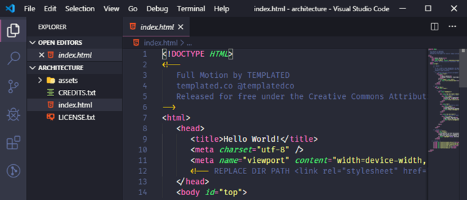
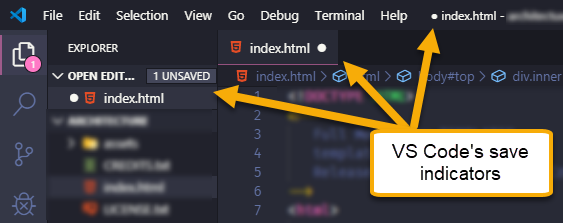

1. Open Visual Studio Code (VS Code) from your installed applications. You can close all the default tabs that display. In VS Code, select **File**  **Open Folder...**. Navigate to and select the "architecture" folder. 

1. In VS Code, expand the "architecture" folder in the **EXPLORER** pane and double click _index.html_ to open it for editing. Your VS Code editor should look like the picture below.

   

1. In the _index.html_ file, search for a line starting with `<!-- REPLACE DIR PATH` and ending with `-->`.
   
The `<!--   -->` wraps a comment in HTML. We'll learn more about it tonight.
   

1. Let's work through the first one we see on line 12 together.
  
1. Remove the opening comment block, `<!-- REPLACE DIR PATH`. Also remove the closing comment mark, `-->` at the end of the same lines.

1. In the remaining code on that line, you’ll see `DIR` where the path of the referenced file should be. Replace `DIR` with the applicable file path. In the example below, the path is `assets/css`.

   Before:

   

   After:
   
   

1. Save your file to see your work by selecting **File**  **Save** in VS Code. You can also use the keyboard shortcut `ctrl + s` on Windows or `cmd + s` on Mac. Unsaved files in VS Code have a little dot on tab of the file and in the **EXPLORER** pane.
   

1. In Chrome, reload _index.html_. Wow! The page looks so different with styles! 

1. In VS Code, go through the rest of the _index.html_ file and make the same necessary changes for the other lines beginning with  `<!-- REPLACE DIR PATH`. Feel free to save and inspect your work in Chrome as you go along. Once done, save _index.html_.
  
If you can't remember the folder names, you can expand the "architecture" folder in VS Code's **EXPLORER** pane.
  

  
Keep an eye out for `data-video="DIR"`. When you get to this code block, make sure to read all the `<!-- Banner -->` comment details for replacing `DIR` with the file path. When you set this, there is **JavaScript** that will load a video in the background of your site.
  

1. Reload _index.html_ in Chrome. Chrome has a powerful built-in way to look for errors and inspect your code, called **Chrome DevTools**. Let's open Chrome DevTools to see if there are any errors finding references.

   
Opening up Chrome DevTools to identify and fix errors is **debugging** code. Fancy!
   

1. Open Chrome DevTools on Windows by pressing `F12` and on a Mac using the keyboard shortcut `cmd + option + i`. If you missed a file reference it will show up as an error. Errors show up as a red 'x' in the toolbar of DevTools. Select **Console** to see more details about an error.
   

1. Fix any errors you find. The red text in the console will give you a clue on where the error is. Pat yourself on the back if you don't have any errors! Pat yourself on the back if you had errors and fixed it using Chrome DevTools! 

   

1. Your site should now be working! We’ve organized all your files AND _index.html_ references all the assets properly.

