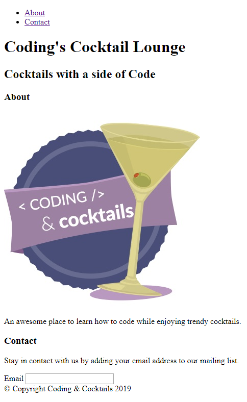

# HTML Structure {#top}

We explored different components that make up a webpage in the last section. The rest of the worksheet will walk you through creating your own _index.html_ page from the ground up. The _index.html_ file is the main HTML for a web page. HTML is one of the building blocks of a web page. It defines the structure of the page and lays the foundation to then add styles and dynamic content. 

In the HTML section of the worksheet, we will create a webpage together that looks like the picture below.

<!-- trick markdown to give me a little space between these two sections of text -->
## 

If you are using CodeSandbox, please skip to [CloudSandbox instructions](#cloud-ide) below.


This section will help guide you through the following steps:


## Create the HTML file {#file} <a href="#top" title="Take me to the top of page"><i class="fa fa-chevron-circle-up" aria-hidden="true"></i></a>


## Create HTML structure {#structure} <a href="#top" title="Take me to the top of page"><i class="fa fa-chevron-circle-up" aria-hidden="true"></i></a>


## HEAD section {#head} <a href="#top" title="Take me to the top of page"><i class="fa fa-chevron-circle-up" aria-hidden="true"></i></a>


## View your web page {#view} <a href="#top" title="Take me to the top of page"><i class="fa fa-chevron-circle-up" aria-hidden="true"></i></a>


Most of our work tonight will be inside the `<body></body>` tags.  This is where visible page content goes.

## References and helpful links {#references} <a href="#top" title="Take me to the top of page"><i class="fa fa-chevron-circle-up" aria-hidden="true"></i></a>
[Mozilla Developer Network Head element documentation](https://developer.mozilla.org/en-US/docs/Web/HTML/Element/head)

## Cloud IDE instructions {#cloud-ide}
<!-- sec data-title="CodeSandbox instructions" data-id="section1" data-show=true data-collapse=true ces -->

<!--endsec-->