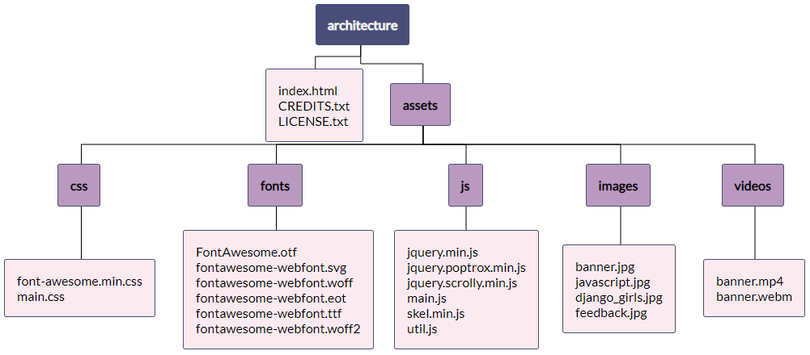

1. Let’s get organizing! Create the necessary folders in the "architecture" directory and move the downloaded project files to the correct folder like in the following diagram.

   

   
The directory name **js** is interchangeable with the directory name **scripts**.
   

   
Open a file explorer by using the command for your OS:
   - Mac- `open .` Press `Enter`.

   - Windows- `start .` Press `Enter`.
  

1. Now open the _index.html_ file in Google Chrome to preview your site. Oh no! Looks like the site is broken. We’re missing the styling and some images specifically. Our HTML page doesn’t know how we’ve organized our project so we’ll need to tell it where to find the files it needs.
   
   

