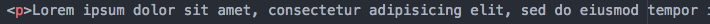

# Part 4: Body Section - Paragraphs
Most websites have some test on the page. Let's add some to ours!

1. After the first `h3` tag, add a paragraph tag (Hint: That's just a `p` tag!)

2. We'll use Emmet to add some text for us for now.  Lorem ipsum text is often used as dummy text in the printing industry to show what the page layout will look like.  Type `lorem` inside the `p` tags and push tab.  This will insert some placeholder lorem ipsum text for you. It should look like this: 

3. Save your html file and refresh in your Google Chrome browser. You should now see something like this: 