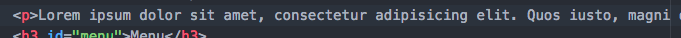

# Part 4: Paragraphs
Most websites have some text on the page. Let's add some to ours!

1. In Atom, after the first `h3` tag, add a paragraph tag (Hint: That's just a `p` tag!) Don't forget to use emmet so you don't have to write out all the `<`, `>` and `/`.

2. You can either write your own text or try using lorem ipsum text. 
Lorem ipsum text is often used as dummy text in the printing industry to show what the page layout will look like when you may not know what your content is yet.

    * To add your own text just type it in between your `p` tags.

    * If you want to use lorem ipsum text for now we'll use emmet to help us quickly add this.   Type `lorem` inside the `p` tags and push `tab`.  This will insert some placeholder lorem ipsum text for you. It should look like this: 
    
    
    
    If you know exactly how many words you want you can specify that with a number after the `lorem` word in your code.  For example if I wanted 50 words I would type `lorem50` and then push `tab`.  

3. Save your html file and refresh in your Google Chrome browser. You should now see something like this: 

###Documentation

[Mozilla Developer Network paragraph element documentation](https://developer.mozilla.org/en-US/docs/Web/HTML/Element/p)