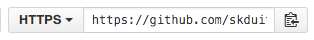

# Troubleshooting

**In Class: Troubleshooting Exercises** { #troubleshooting } 

Let’s have some practice troubleshooting so you can feel more confident coding on your own!

1.  Log in to your personal GitHub account
2.  Navigate to [https://github.com/KansasCityWomeninTechnology/examples](https://github.com/KansasCityWomeninTechnology/examples)
3.  Click the “Fork” button in the upper right
  a.  If necessary choose your personal GitHub account
4.  Navigate to your version of the examples repository 
  a.  This should loook like [https://github.com/](https://github.com/)&lt;your username&gt;/examples)
5.  Click the small clipboard icon next to the url just above the file names to copy the url to your clipboard:     
6.  In Git Bash (Windows) or iTerm2 (Macs) navigate to your CodingAndCocktails folder. You will store anything we work on from GitHub here.
    a.  Check your current directory location with the command “pwd”
    b.  Move to a new directory with the command “cd”
    c.  Create a new directory with the command “mkdir CodingAndCocktails”
3.  Ttype `git clone &lt;paste your examples repository url here&gt;` This will create a directory called examples for you with the contents from GitHub inside the directory.
4.  Open that examples directory in SublimeText.
5.  Open up the troubleshooting folder and take a look at exercise 1 (HTML focus) and work through the exercise
6.  If you finish exercise 1 try exercise 2 (CSS focus)
7.  If you finish both exercises try the bonus exercise.