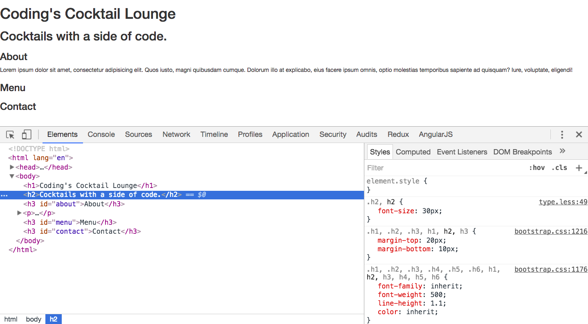
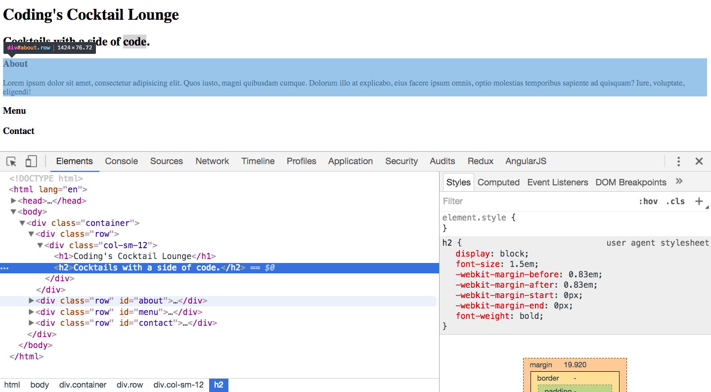
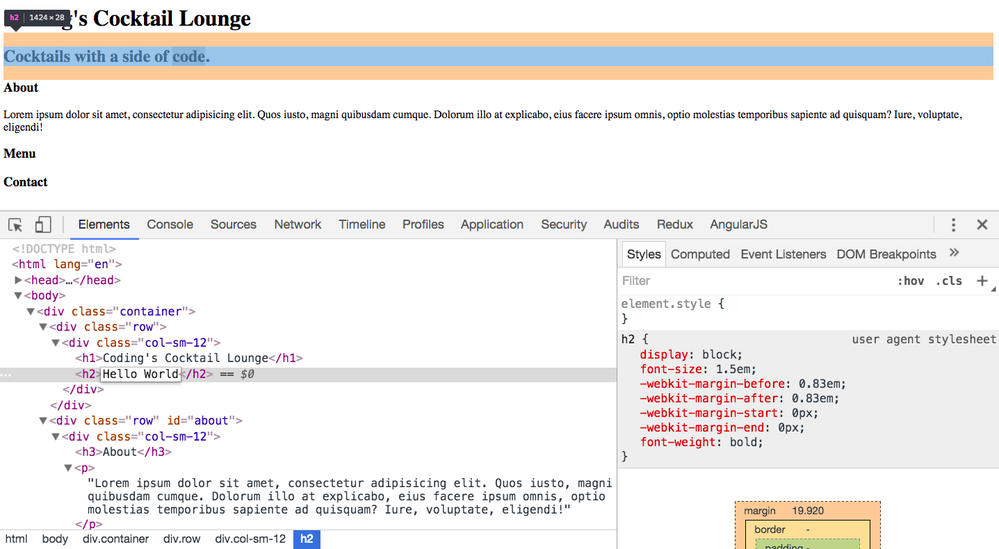
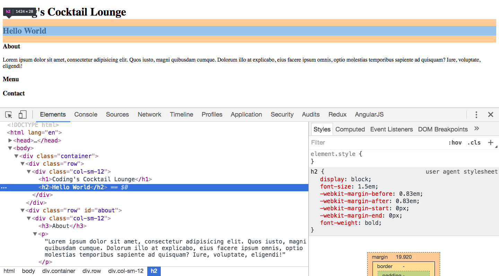

1. In Google Chrome, right-click on your `<h2>` element and select **Inspect**

    This will open up your Chrome Developer Tools (Dev Tools) to the **Elements** tab
    
2. Notice you can see all of your tags that you've added to the page and how they are nested inside each other. It should look something like this:

3. Notice as you mouse over elements in the Dev Tools that they are highlighted in the rendered view above.

4. You can also click the arrows to the left of your `
` elements to expand them and see the elements inside them.

In addition viewing elements, you can make and preview changes here before making them in your code.
1. In the **Elements** section of the Dev Tools, double click on the text inside your `<h2>` tag. This should make it editable. Change it to "Hello World" and then press `enter` 

1. Your `<h2>` text should now display "Hello World" on your rendered page.
    
    
    This only lasts until you refresh the page! If you want to make a lasting change you need to make the change to your code. 

1. Refresh your page to see your text return to what you have in your code.
    
You can either keep your Dev Tools open or close them with the small x in the upper right corner of the Dev Tools

Another quick way to open the tools at any time is through a keyboard short cut:
    
| Windows Key Combination|Mac Key Combination |
|---|---|
|`ctrl` + `shift` + `i`|`cmd` + `option` + `i`|

Element inspection comes in very handy when you're trying to style your page too so we'll use this a lot next month when we learn about CSS!
