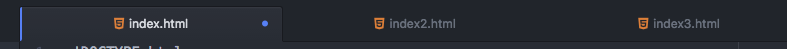

1. In Atom, between the opening and closing `<body></body>` tags, type 

   ```html
   <div class="container">
   </div>
   ```
   
   This will create a `<div>` element with a `class` attribute with the value of "container" and will be the main container element for our page.
    
   Elements can have `class` and `id` attributes. Want to know the difference between an `id` and a `class`?  Check out <a href="http://bit.ly/CnCIDvsClass">http://bit.ly/CnCIDvsClass</a>
    
   Your body section should now look like this: 
   index.html
   ```html
   <body>
      <div class="container">
      </div>
   </body>
   ```
      The linter we installed will help you catch mistakes. When the linter catches an error such as forgetting to close a HTML tag, Atom will display a red underline. Sometimes the underline shows up on the tag **after** the mistake! 


1. Create another `<div>` element with class `row` nested inside the `div` we just created. This time we'll use Emmet. Emmet will auto complete standard HTML tags for you. You can also have Emmet add extra attributes for you too. Place your cursor between the `<div></div>` tags and type `div.row` then press `Tab`. 

   _Don't forget to indent so your code is easy to read!_
   Your body section should now look like this: 
   index.html
   ```html
   <body>
      <div class="container">
         <div class="row"></div>
      </div>
   </body>
   ```
    
    Classes are often used to apply styling to elements - we will learn about styling next month. We'll see this in action later in the worksheet.  For now, don't worry too much about what the classes mean - we're focusing on the HTML this month.
    
1. Save the page, switch over to Google Chrome and reload.  Even though we've started adding content to the `<body>` section there is still nothing to see.
    
    If the file has not been saved you'll notice a small dot on the right side of the file's tab.  That goes away when the file has been saved.  The active tab has a blue line to the left so in the image below index.html is the selected tab and changes have not been saved.

    
