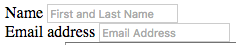

1.  Between the opening and closing tags for the second form-group div, add a `<label>` element.

1. Set the `for` attribute to **"emailInput"**.

2. Between the opening and closing tags set the text to **"Email Address"**.

3. Below the `label` element, add an `input` element with an id of **"emailInput"** but this time change the `type` attribute to **"email"**.

4. On the `input` element, add a `name` attribute with a value of **"_replyto"**.  This is another requirement to make the form work with Formspree.

5. Add a `class` attribute of **"form-control"**.

6. Add a `placeholder` attribute with a value of **"Email Address"**.

8. Save your file and reload it in Google Chrome. Progress! It should look like this:

    
