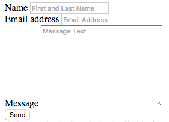

1. In between the the final form-group `
` opening and closing tags, add an `<input>` element with a `type` value of **"submit"**.

1. Add two classes: **btn** and **btn-default**.
     
2. Add a `value` attribute with a value of "Send". 
    
    Type `input.btn.btn-default` and then press the `Tab` key to have Emmet add both classes to the input element at the same time.
    
    The `value` attribute sets the text of the submit button so feel free to set the text to whatever you'd like!

1. Save your file and reload it in Google Chrome. The final form should look like this: 
    
        
 
Since our websites are not deployed to a server, the form won't actually work right now. 

If you'd like to try putting your site up on the internet ask a mentor to help you push it up to GitHub Pages and then you can test out your form.  The way Formspree works is that you'll have to test it once, which will send you an email asking you to confirm your email address and from then on, your form will be functioning!
