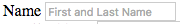

1. In between the first opening and closing `div.form-group` tags, add a `<label>` element. Type the Emmet command `label`  and press the `tab` key.
    
2. Set the label's `for` attribute value to **"nameInput"**
     
3. Add the text **"Name"** in between the opening and closing label tags.
    
3. Just below the label element use the Emmet command `input#nameInput.form-control` to create your input element with the id **"nameInput"** and class **form-control**.

     Remember, ids are created by using a `#` followed by the id name you want to add and classes are created by using a `.` followed by the class name you want to add

4. Add a `name` attribute to that `input` element and set its value to **"name"**

     Emmet automatically added a `type` attribute with the value "text" for our name input, which is exactly what we want. Perfect!
     
5. Also add a `placeholder` attribute and set the value to **"First and Last Name"**. 
     Your code should look similar to this now:
     ```html
     <div class="form-group">
         <label for="nameInput">Name</label>
         <input type="text" id="nameInput" name="name" class="form-control" placeholder="First and Last Name">
     </div>
     ```   
    
6. Save your file and reload it in Google Chrome.  The form is starting to come together!  It should look like this:
    
    