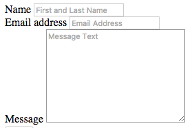

1.  Inside the third form-group add a `label` element.

1. Set the `label` element's `for` attribute to **"messageInput"**.

2. Add text **"Message"** between the opening and closing `label` tags.

3. Below the label, use Emmet to add a `textarea` element with a `class` of **"form-control"**. (Hint: Use Emmet command `textarea.form-control`).

4. Set the `name` attribute of the `textarea` element to **"message"**

5. Set the `id` attribute to **"messageInput"**.

6. Leave the `cols` and `rows` attributes at the default values provided.

7. Add a `placeholder` attribute with a value of **"Message Text"**.

    Why are we using a textarea element instead of an input element here? Look at the MDN documentation for input linked at the bottom of the page. Scroll down to the `type` attribute and look at the explanation for the value of "text".  The input only allows a single line of text the `type` attribute is "text".  Since a message can span multiple lines, a `textarea` element is a better choice for the message.

10. Save your file and reload it in Google Chrome. It should look like this:

    
