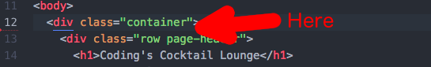

1. Above the first `
` add a new section using the Emmet command `div.row`.

    

    Don't forget-- if you place your cursor on any HTML element, Atom will underline the matching opening or closing tag for you. 

1. Between the opening and closing `
` tags you just created, add a `<nav>` element with the classes **navbar** and **navbar-default**.

1. Save your file and reload it in Google Chrome.
    Nothing to see here. How does a user move around? We'll add the navigation links later in this section.
    
